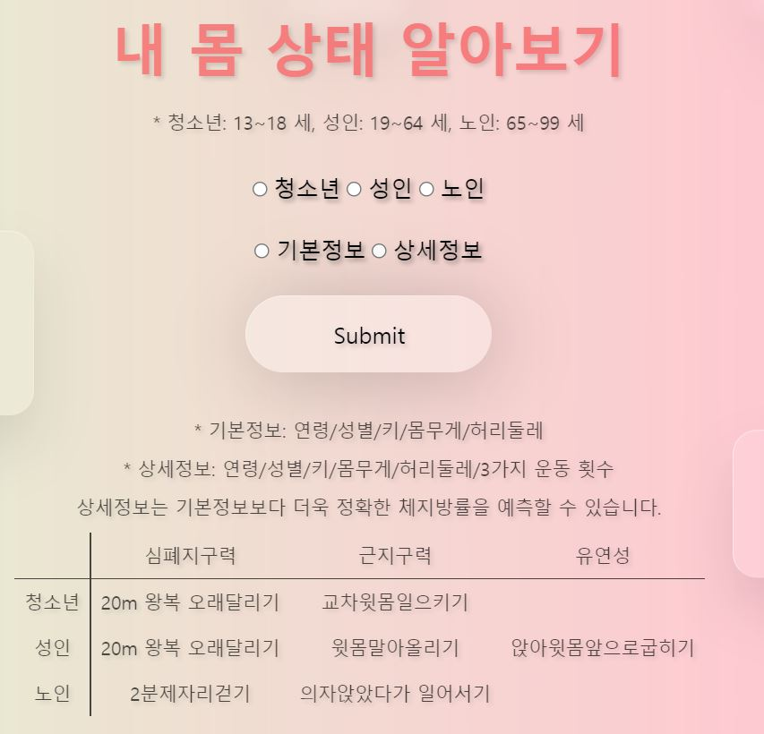
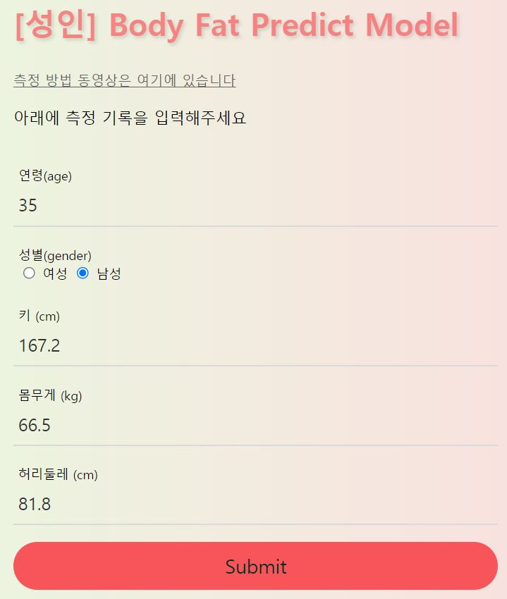
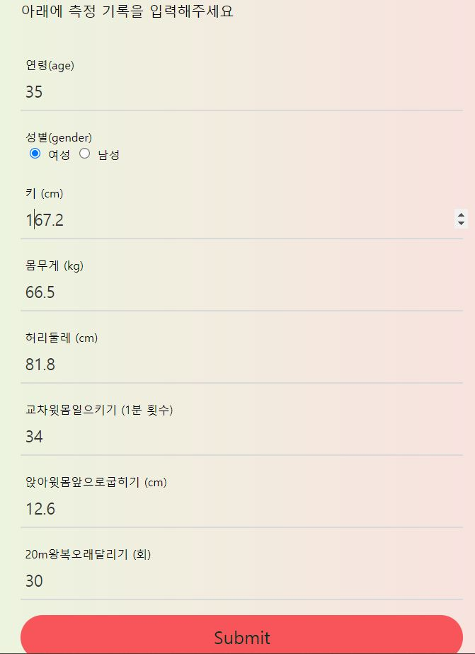
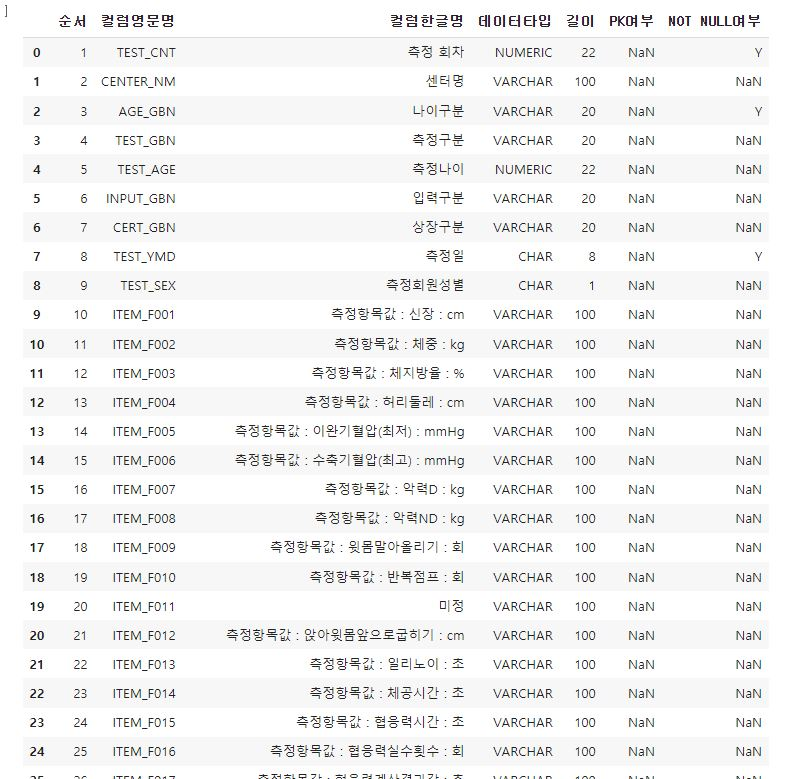
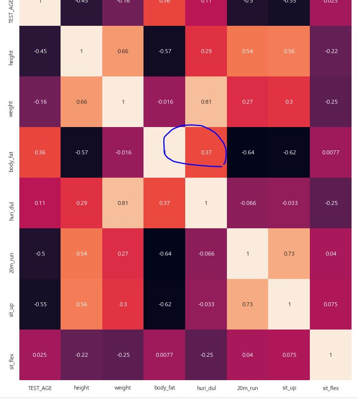

# 체지방률 예측과 AI 트레이너
## 프로젝트 계획 이유
코로나로 인해 외출을 자제하도록 권장하고 있습니다. 헬스장이나 체지방 측정기가 필요 없이 빅데이터로 자신의 체지방률을 예측해볼 수 있는 모델을 제공하여 쉽게 측정이 가능합니다.

 요구되는 속성들의 값을 입력하게 되면 체지방률과 그에 맞는 피드백 그리고 운동을 코칭해주는 인공지능 트레이너까지 제공합니다. 현재는 스쿼트 운동만 코칭해주며 집에서 쉽게 할 수 있는 운동도 추가해볼 예정입니다. 카메라가 필요하며 해당 카메라로 포즈를 인식하여 운동 개수를 카운트 해주는 구조입니다.

## 프로젝트 기능 설명
### [선택기능]

 </img> 

- 자신의 연령에 맞는 연령정보(청소년, 성인, 노인)를 선택할 수 있는 기능

- 상세정보와 기본정보를 선택할 수 있는 기능
  - 상세정보를 입력 시 더 정확한 예측이 가능

 

### [입력기능] - 기본정보

 </img> 

- 사용자의 연령, 성별, 신체정보를 입력할 수 있는 기능

 

### [입력기능] - 상세정보

 </img> 

- 사용자의 기본정보 + 측정정보를 입력할 수 있는 기능

 

### [피드백]

 </img> 

- 입력정보에 대한 체지방률 예측과 각종 피드백 제공
- 필요 시 AI 트레이너 웹 사이트로 이동할 수 있는 운동하기 버튼 제공

 

### [AI 트레이너]

- 카메라 액세스 기능
- 카메라를 보고 스쿼트 자세를 취하면 Count 해주는 기능
- 현재 개수를 말해주는 음성 지원 기능
- 잘못된 자세를 인식하여 말해주는 음성 지원 기능
- netlify를 이용하여 정적 콘텐츠 배포
  - https://agitated-tesla-6f47a6.netlify.app

 

## 모델 설명

### [데이터 수집]

- KESPO(국민체육진흥공단) 체력측정 항목별 측정 데이터 약 44만개

### [데이터 확인]

 </img> 

### [데이터 분석]

 </img> 

- 판다스 데이터프레임에서 제공하는 피어슨 상관관계 분석을 통해 모든 연령층에서 허리둘레가 체지방률에 영향을 많이 주는 것을 알 수 있음

### [데이터 정제 1]

- 성인 / 노인 / 청소년 데이터 분리
- 기본정보(나이, 성별, 신장, 체중, 체지방률, 허리둘레) 결측지 제거
- 체지방률 이상치 그래프로 확인 후 제거
- 학습 칼럼과 예측 칼럼 분리
  - 학습 칼럼: 나이, 성별, 신장, 체중, 허리둘레
  - 예측 칼럼: 체지방률
- 학습 데이터와 검증 데이터 분리

### [데이터 정제 2]

- 성인 / 노인 / 청소년 데이터 분리
- 기본정보 + 측정정보(심폐지구력, 근기능, 유연성) 결측지 제거
  - 나이구분에 따라 측정칼럼이 다름
- 체지방률 이상치 그래프로 확인 후 제거
- 학습 칼럼과 예측 칼럼 분리
  - 학습 칼럼: 나이, 성별, 신장, 체중, 허리둘레 + 측정정보
  - 예측 칼럼: 체지방률
- 학습 데이터와 검증 데이터 분리
  
### [모델 생성]

- tensorflow.keras 를 사용하여 레이어를 쌓고
- Adam optimizer, loss, metrics 값 설정 후 Compile 진행
  - 연속적인 값을 예측하기 때문에 
  - loss: MSE(평균제곱오차)
  - metrics(평가지표): MAE(평균절대오차)
- 하이퍼 파라미터(batch_size, epochs 등) 값 설정
- 나이구분(성인, 노인, 청소년)과 기본정보로 모델 학습 후 생성 
- 나이구분(성인, 노인, 청소년)과 기본정보 + 측정정보로 모델 학습 후 생성
- 총 6가지의 모델 도출

### [모델 테스트]

- 테스트 데이터를 모델에 주입시켜 체지방률 예측 값과 실제 값을 비교하여 차이 값 확인

 

## 사용 기술
- Kakao Speech API, MobaXterm
- Google Teachable Machine
- keras, tensorflow, numpy, pandas, sklearn, matploblib, seabron, ..

## 개발 환경
- Python, Django, Anaconda, Jupyter, Colab
- CSS, JS, HTML

## 후기
딥러닝 모델이 아닌 기존에 제공하는 머신러닝 모델(알고리즘)로 진행하여 비교해보면 좋을 것 같다.

## 참고
